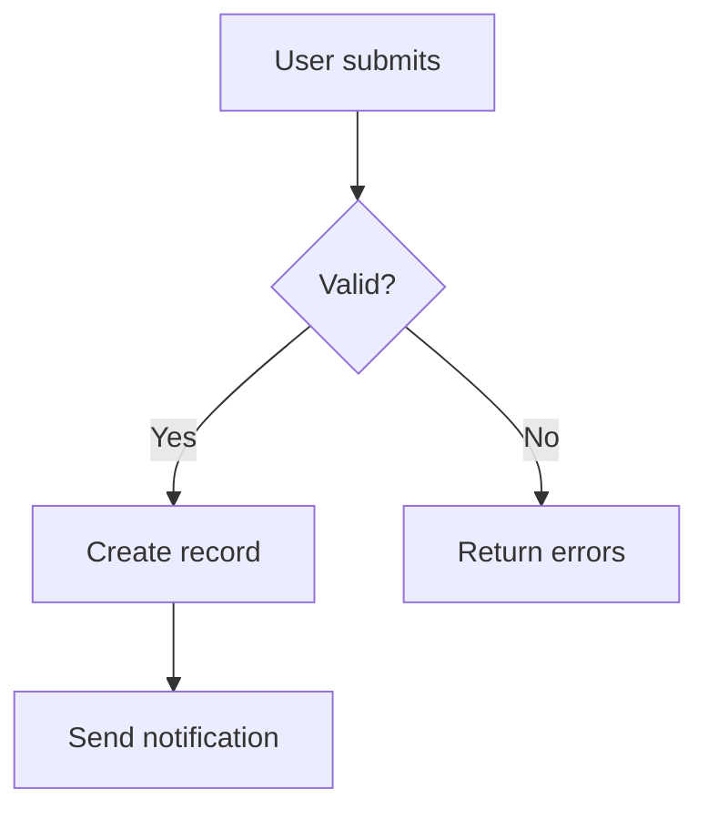
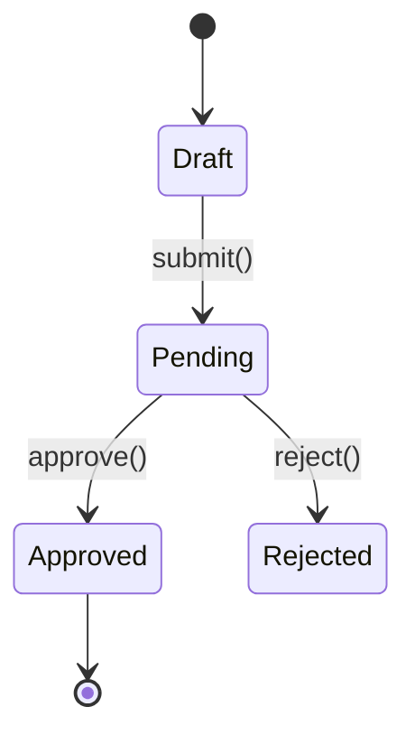
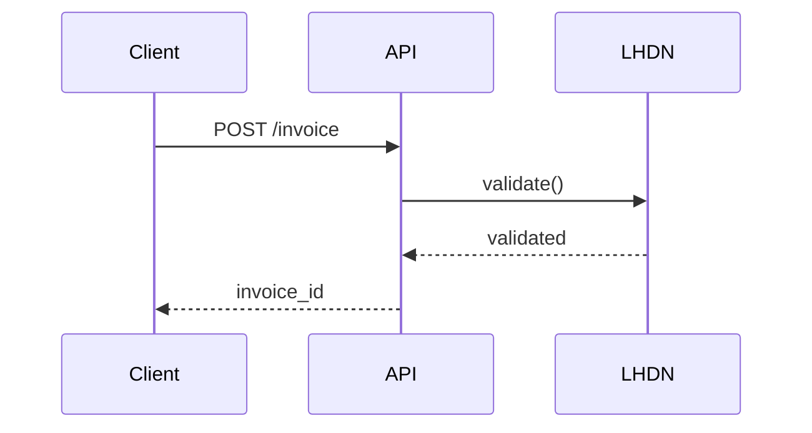
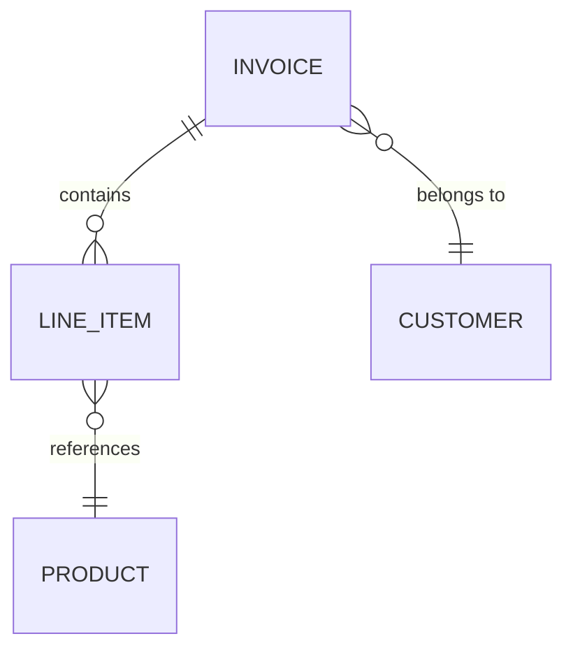
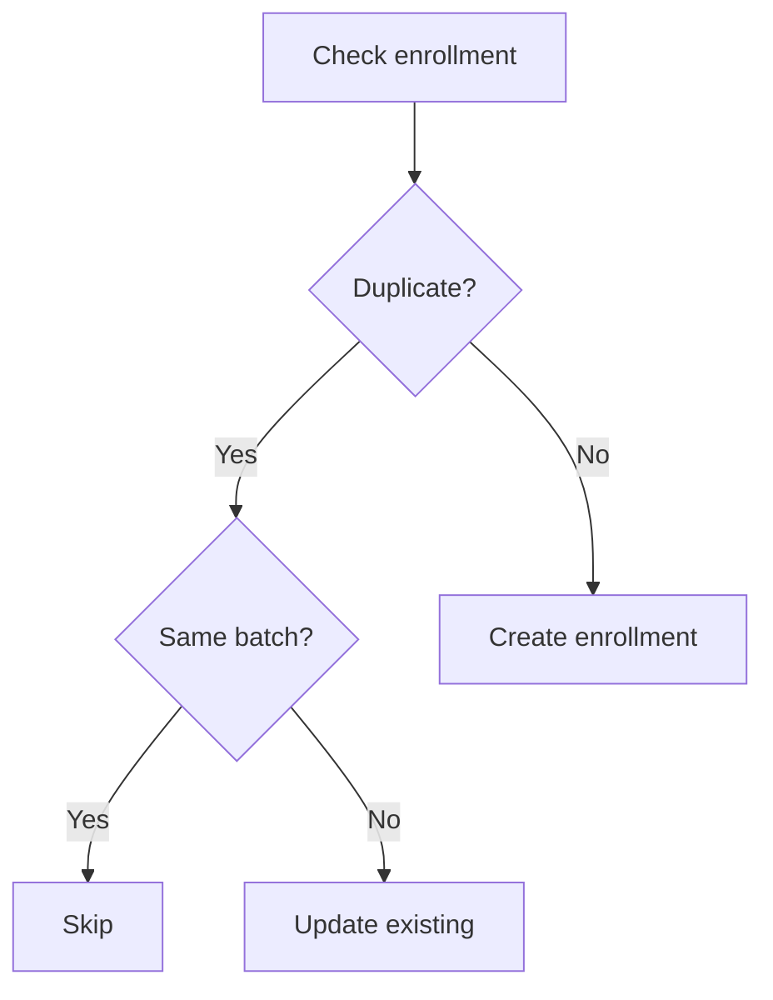
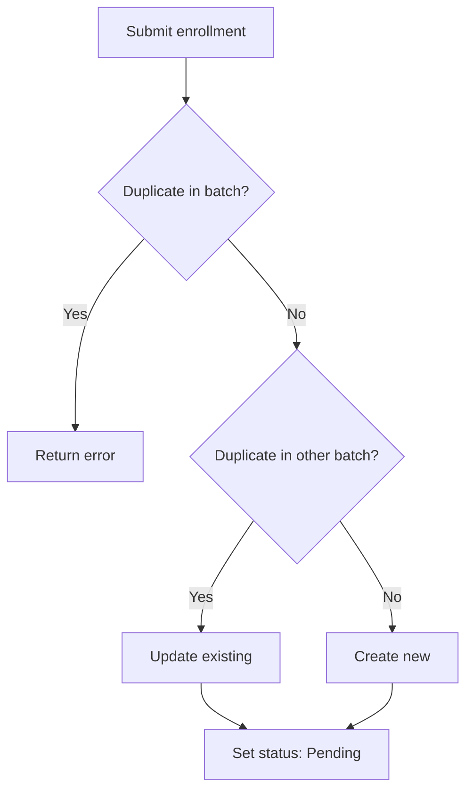
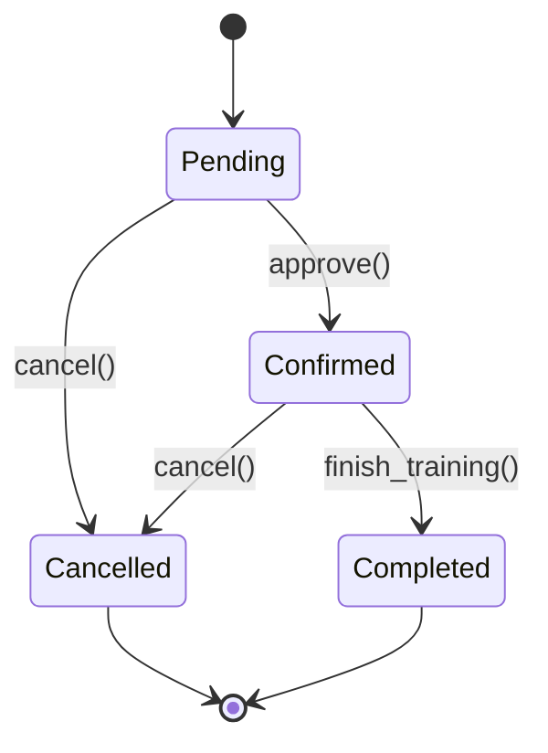

Create task documentation for humans and LLM agents.

## Path Resolution

| $ARGUMENTS | Target |
|------------|--------|
| Provided | Use as-is |
| Empty | Infer → `tasks/<domain>/<feature>/current.md` |
| Exists | Append/update relevant parts |

## Requirements

1. Document discussion points from session
2. Include file paths and code locations
3. Capture decisions with rationale
4. Add next steps
5. Write incrementally (section-by-section)
6. **Use tables over prose; mermaid for flows/relationships**

## Mermaid Usage Strategy

**When to use mermaid** (saves tokens vs tables/prose):

| Scenario | Mermaid Type | Token Savings |
|----------|--------------|---------------|
| 5+ step workflow/process | `graph TD` | ~40% vs numbered list |
| State transitions (3+ states) | `stateDiagram-v2` | ~50% vs table |
| Multi-entity relationships | `erDiagram` or `graph LR` | ~30% vs prose |
| API call sequences | `sequenceDiagram` | ~60% vs prose |
| Decision trees (3+ branches) | `graph TD` with diamonds | ~45% vs nested lists |

**When NOT to use mermaid**:
- Simple 2-3 item lists → use bullet points
- Single linear flow → use numbered list
- Key-value pairs → use table
- File paths only → use code blocks

**Mermaid Pattern Library:**
````markdown
<!-- Workflow (use for multi-step processes) -->


<!-- State Machine (use for status workflows) -->


<!-- API Sequence (use for multi-service flows) -->


<!-- Entity Relationships (use for data model clarity) -->


<!-- Decision Flow (use for complex business logic) -->

````

**Integration with sections:**

| Section | Use Mermaid If... | Example |
|---------|-------------------|---------|
| Overview | Complex architecture | System components diagram |
| Implementation | Multi-file workflow | File interaction flow |
| API Endpoints | Request/response flow | Sequence diagram |
| Database Changes | 3+ table relationships | ER diagram |
| Gotchas | Multi-step error scenario | Decision tree showing failure paths |
| Next Steps | Task dependencies | Graph showing blockers |

## LLM-CONTEXT Block (Required)

Every `current.md` must start with an LLM-CONTEXT block:
````markdown
<!--LLM-CONTEXT
Purpose: 1-line summary
Key files: comma-separated list
Gotchas: critical gotcha if any
Related: tasks/shared/*.md, other domain docs
Diagrams: [workflow|state|sequence|er] (if mermaid used below)
-->
````

**Related field**: Cross-reference shared patterns and related domain docs so agents can discover connections.

**Diagrams field**: List diagram types so agents know to scan for visual context (e.g., `Diagrams: workflow, er`)

## Shared Patterns Check

Before writing, check if content belongs in `tasks/shared/`:

| Pattern Type | Shared Location | Domain Doc Action |
|--------------|-----------------|-------------------|
| Gotcha in 3+ domains | `tasks/shared/gotchas-registry.md` | Cross-reference only |
| Enum values, constants | `tasks/shared/enums.md` | Cross-reference only |
| Payment types, billing | `tasks/shared/payment-patterns.md` | Cross-reference only |
| State machines (reused) | `tasks/shared/state-machines.md` | Cross-reference + domain-specific notes |
| API patterns (reused) | `tasks/shared/api-patterns.md` | Cross-reference + endpoint specifics |

**Rule**: Add to shared AND reference from domain doc.

## Output Structure
````markdown
# [Feature Name]

<!--LLM-CONTEXT
Purpose: Brief description
Key files: app/..., resources/js/...
Related: tasks/shared/gotchas-registry.md, tasks/other-domain/current.md
Diagrams: workflow, state (if diagrams below)
-->

**Status**: [emoji] [state] | **Updated**: [date]

## Overview
Brief description.

[Optional: Architecture/workflow mermaid if 5+ components]

## Key Decisions
| Decision | Rationale |
|----------|-----------|
| Use X over Y | Performance: 40% faster |

## Implementation

### Workflow
[Mermaid diagram if multi-step process, else numbered list]

### Files Modified
| File | Purpose | Key Changes |
|------|---------|-------------|
| `app/Domains/X/Actions/CreateY.php` | Main action | Added validation |

### API Endpoints
| Method | Endpoint | Purpose |
|--------|----------|---------|
| POST | `/api/enrollments` | Create enrollment |

[Optional: Sequence diagram if multi-service interaction]

### Database Changes
[Mermaid ER diagram if 3+ table relationships]
```sql
-- Migration details
ALTER TABLE enrollments ADD COLUMN status VARCHAR(20);
```

## Gotchas
| Error/Symptom | Root Cause | Solution |
|---------------|------------|----------|
| `500 on POST /enroll` | Duplicate key violation | Check existing before insert |

[Optional: Decision tree mermaid for complex error scenarios]

## State Machine (if applicable)
[Mermaid stateDiagram-v2 showing status transitions]

## Related
- [`tasks/shared/state-machines.md`](../../shared/state-machines.md) — Reusable enrollment states
- [`tasks/amendments/current.md`](../../amendments/current.md) — Status transition patterns
- `archive/enrollment-v1.md` - Historical implementation (deprecated)

## Next Steps
- [ ] Pending items (only if incomplete work)
````

## Mermaid Embedding Rules

1. **Always wrap in code fences**: ` ```mermaid ` (not inline)
2. **Add context comment above diagram**: `<!-- Enrollment workflow showing validation steps -->`
3. **Keep diagrams focused**: Max 10-12 nodes; split complex flows
4. **Use consistent node IDs**: `A[User Action]` not `Start[User Action]`
5. **Test locally first**: Paste into https://mermaid.live to verify syntax

## Token Efficiency Check

After writing, verify:
````markdown
| Content | Current Format | Better Format? |
|---------|----------------|----------------|
| 8-step approval flow | Numbered list (120 tokens) | ✅ Mermaid workflow (65 tokens) |
| 5 status transitions | Prose paragraph (90 tokens) | ✅ State diagram (40 tokens) |
| 3 API endpoints | Table (45 tokens) | ❌ Keep table (mermaid: 60 tokens) |
| File path list | Code block (30 tokens) | ❌ Keep code block |
````

**Rule**: Use mermaid if token savings > 30% AND improves scannability.

## Output Example
````markdown
# Participant Enrollment System

<!--LLM-CONTEXT
Purpose: Handle training participant enrollment with duplicate prevention
Key files: app/Domains/Training/Actions/EnrollParticipant.php, app/Domains/Training/Models/Enrollment.php
Related: tasks/shared/state-machines.md, tasks/training/jd14/current.md
Diagrams: workflow, state
-->

**Status**: 🚀 Testing | **Updated**: 2025-01-29

## Overview
Enrollment system with duplicate detection across batches and status-based workflow.

## Implementation

### Enrollment Workflow
<!-- Shows validation, duplicate check, and creation flow -->


### Status State Machine
<!-- Valid status transitions for enrollment lifecycle -->


### Files Modified
| File | Purpose |
|------|---------|
| `app/Domains/Training/Actions/EnrollParticipant.php` | Main enrollment logic |
| `app/Domains/Training/Models/Enrollment.php` | Status enum, relationships |

## Gotchas
| Error/Symptom | Root Cause | Solution |
|---------------|------------|----------|
| `500 on POST /enroll` | BackedEnum not cast | `$status->value` before DB insert |

## Related
- [`tasks/shared/state-machines.md#enrollment`](../../shared/state-machines.md#enrollment) — Standard enrollment states
- [`tasks/training/jd14/current.md#duplicate-logic`](../jd14/current.md#duplicate-logic) — Duplicate prevention shared logic
````

## Workflow Steps

1. **Scan session** for content triggers (workflows, states, relationships)
2. **Check shared patterns** — extract to `tasks/shared/` if reusable
3. **Draft LLM-CONTEXT** with Related and Diagrams fields
4. **Write sections** incrementally, inserting mermaid where token-efficient
5. **Verify mermaid syntax** (copy to mermaid.live if unsure)
6. **Add cross-references** to shared docs and related domains
7. **Final check**: Line count, token efficiency, scannability

---

$ARGUMENTS